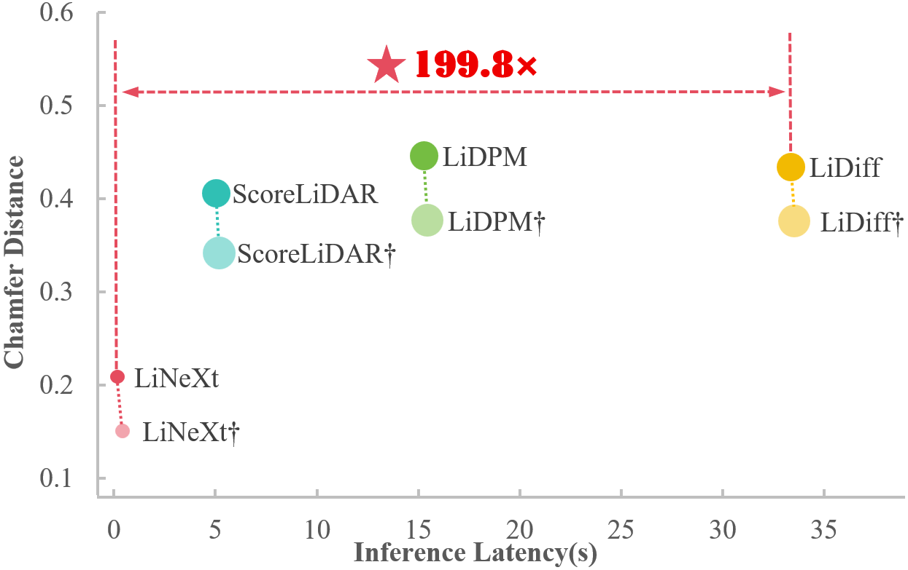

# LiNeXt: Revisiting LiDAR Completion with Efficient Non-Diffusion Architectures (AAAI26)

<p align="center">
  
</p>

## Abstract
3D LiDAR scene completion from point clouds is a fundamental component of perception systems in autonomous vehicles. Previous methods have predominantly employed diffusion models for high‑fidelity reconstruction. However, their multi‑step iterative sampling incurs significant computational overhead, limiting real‐time applicability. To address this, we propose LiNeXt—a lightweight, non‐diffusion network optimized for rapid and accurate point cloud completion. Specifically, LiNeXt first applies the Noise‑to‑Coarse (N2C) Module to denoise the input noisy point cloud in a single pass, thereby obviating the multi‑step iterative sampling of diffusion‑based methods. The Refine Module then takes the coarse point cloud and its intermediate features from N2C Module to perform more precise refinement, further enhancing structural completeness. Furthermore, we observe that LiDAR point clouds exhibit a distance‑dependent spatial distribution—densely sampled at proximal ranges and sparsely sampled at distal ranges. Accordingly, we propose the Distance‑aware Selected Repeat strategy to generate a more uniformly distributed noisy point cloud. On the SemanticKITTI dataset, **LiNeXt achieves a 199.8× speedup in inference, reduces Chamfer Distance by 50.7\%, and uses only 6.1\% of the parameters compared with LiDiff**. These results demonstrate the superior efficiency and effectiveness of LiNeXt for real-time scene completion.

## Dependencies
```
# Create and activate environment
conda create -n LiNeXt python=3.9 -y
conda activate LiNeXt

# Install PyTorch (CUDA 11.7 build)
pip install torch==1.13.1+cu117 torchvision==0.14.1+cu117 torchaudio==0.13.1 \
    --extra-index-url https://download.pytorch.org/whl/cu117
pip install pytorch-lightning==1.8.1

# Fix basic dependencies
pip install "pip<24.1"
pip install "numpy<2" -U
sudo apt install build-essential python3-dev libopenblas-dev
pip install setuptools==59.5.0 numpy==1.23.5

# install MinkowskiEngine
cd LiNeXt-main
git clone https://github.com/NVIDIA/MinkowskiEngine.git
cd MinkowskiEngine
python setup.py install

# PointNet2 CUDA Extension
cd models
pip install ./pointnet2_ops_lib --no-build-isolation

# Install other dependencies
pip install -r requirements.txt --no-build-isolation --prefer-binary
```

## Training and testing

[//]: # (We provide pre-trained [Noise-to-Coarse &#40;N2C&#41; Module]&#40;LiNeXt-main/ckpt/Denoise_epoch=09.ckpt&#41; and [Refine Module]&#40;LiNeXt-main/ckpt/Refine_Up6_epoch=04.ckpt&#41; checkpoints for reproducibility and further benchmarking. All models were trained on the SemanticKITTI dataset. )
To train the Noise-to-Coarse (N2C) Module, run 
```
CUDA_VISIBLE_DEVICES=0 python train.py
```
For the Refine Module, run 
```
CUDA_VISIBLE_DEVICES=0 python train_refine.py
```
To test the model, please run 
```
python3 -m linext.tools.completion_pipeline  --n2c /n2c_ckpt_path --path_scan /pcd_path
```
To evaluate the metric of the model, please run 
```
python3 -m linext.tools.completion_pipeline  --n2c /n2c_ckpt_path --use_eval True
```


## Evaluation
Reconstruction metrics Chamfer Distance (CD↓), inference time (Time↓), and model parameters (Param↓) are compared as follows:
| Method      | CD↓   | Time(s)↓ | Param(M)↓ |
| ----------- | ----- | -------- | --------- |
| LiDiff      | 0.434 | 33.359   | 32.67     |
| LiDPM       | 0.446 | 15.288   | 32.67     |
| ScoreLiDAR  | 0.406 | 5.047    | 32.67     |
| LiNeXt      | 0.214 | 0.167    | 1.99      |
| LiDiff†     | 0.376 | 33.531   | 54.40     |
| LiDPM†      | 0.377 | 15.453   | 54.40     |
| ScoreLiDAR† | 0.342 | 5.189    | 54.40     |
| LiNeXt†     | 0.149 | 0.434    | 2.10      |

† indicates additional refinement.

The visual comparison is presented below.
<p align="center">
  
</p>

## 📚 Citation

If you find this project useful in your research or work, please consider citing our paper:

```bibtex
@misc{he2025linextrevisitinglidarcompletion,
  title        = {LiNeXt: Revisiting LiDAR Completion with Efficient Non-Diffusion Architectures},
  author       = {Wenzhe He and Xiaojun Chen and Ruiqi Wang and Ruihui Li and Huilong Pi and Jiapeng Zhang and Zhuo Tang and Kenli Li},
  year         = {2025},
  eprint       = {2511.10209},
  archivePrefix= {arXiv},
  primaryClass = {cs.CV},
  url          = {https://arxiv.org/abs/2511.10209}
}
## 🙏 Acknowledgements

We sincerely thank the authors of the following open-source projects, which have greatly inspired and supported this work:

- **LiDiff**  
  https://github.com/PRBonn/LiDiff  

- **ScoreLiDAR**  
  https://github.com/happyw1nd/ScoreLiDAR  

- **LiDPM**  
  https://github.com/astra-vision/LiDPM  

These repositories provide valuable baselines and insights for LiDAR scene completion, generative modeling, and diffusion-based methods.


